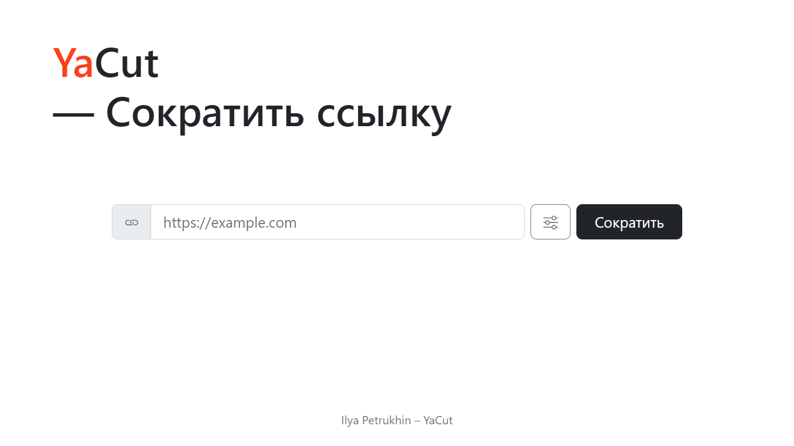
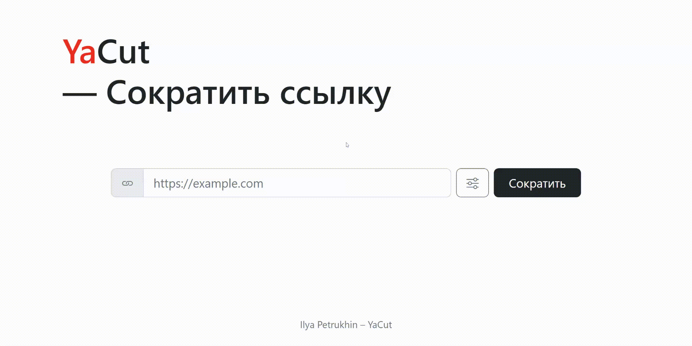

# YaCut — Сократить ссылку

Сервис укорачивания ссылок.
Его назначение — ассоциировать длинную пользовательскую ссылку с короткой,
которую предлагает сам пользователь или предоставляет сервис.

### ✨ Возможности

- Генерация коротких ссылок и связь их с исходными длинными ссылками.
- Переадресация на исходный адрес при обращении к коротким ссылкам.
- REST API

### 🧰 Технологии

[![Flask][Flask-badge]][Flask-url]
[![SQLAlchemy][SQLAlchemy-badge]][SQLAlchemy-url]
[![Gunicorn][Gunicorn-badge]][Gunicorn-url]
[![Postgres][Postgres-badge]][Postgres-url]
[![Docker][Docker-badge]][Docker-url]
[![Nginx][Nginx-badge]][Nginx-url]

## ⚙ Начало Работы

Чтобы запустить локальную копию проекта, следуйте инструкциям ниже.

### ⚠ Зависимости

- [Python 3.7+][Python-url]
- [Docker][Docker-url]

### 🡇 Установка

1. **Клонируй репозиторий**

    ```shell
    git clone https://github.com/tvules/YaCut.git
    cd YaCut
    ```

### 🚀 Локальный Запуск (Docker)

1. **В корне проекта создай `.env` файл**

    ```dotenv
    FLASK_APP=yacut
    FLASK_DEBUG=0
    DATABASE_URI="postgresql://postgres:postgres@db:5432/postgres"
    SECRET_KEY=<секретный ключ>
    POSTGRES_USER=postgres
    POSTGRES_PASSWORD=postgres
    ```

    ###### **Секретный ключ можно сгенерировать [тут](https://djecrety.ir/)*

2. **Выполни сборку и запуск контейнеров docker**

    ```shell
    cd infra
    docker compose up --build
    ```
    
    **После запуска, проект будет доступен по адресу http://localhost/**

## 🕹 Использование



### API (Docs: [OpenAPI](docs/openapi.yml))

- **POST** `/api/id/`
- **GET** `/api/id/{short_id}/`

## 🛠 Development

1. **Установи зависимости проекта**

    ```shell
    pip install -r requirements.txt
    ```

2. **В корне проекта создай `.env` файл**

    ```dotenv
    FLASK_APP=yacut
    FLASK_DEBUG=1
    DATABASE_URI=<URI базы данных, по умолчанию "sqlite:///db.sqlite3">
    SECRET_KEY=<секретный ключ>
    ```

3. **Запусти dev-сервер**

    ```shell
    flask run
    ```

<h5 align="center">Автор проекта: <a href="https://github.com/tvules">Ilya Petrukhin</a></h5>

[Python-badge]: https://img.shields.io/badge/python%203.7+-3670A0?style=for-the-badge&logo=python&logoColor=ffdd54
[Python-url]: https://www.python.org/
[Flask-badge]: https://img.shields.io/badge/flask-%23000.svg?style=for-the-badge&logo=flask&logoColor=white
[Flask-url]: https://flask.palletsprojects.com
[SQLAlchemy-badge]: https://img.shields.io/badge/sqlalchemy-fbfbfb?style=for-the-badge
[SQLAlchemy-url]: https://www.sqlalchemy.org/
[Gunicorn-badge]: https://img.shields.io/badge/gunicorn-%298729.svg?style=for-the-badge&logo=gunicorn&logoColor=white
[Gunicorn-url]: https://gunicorn.org/
[Postgres-badge]: https://img.shields.io/badge/postgres-%23316192.svg?style=for-the-badge&logo=postgresql&logoColor=white
[Postgres-url]: https://www.postgresql.org/
[Docker-badge]: https://img.shields.io/badge/docker-%230db7ed.svg?style=for-the-badge&logo=docker&logoColor=white
[Docker-url]: https://www.docker.com/
[Nginx-badge]: https://img.shields.io/badge/nginx-%23009639.svg?style=for-the-badge&logo=nginx&logoColor=white
[Nginx-url]: https://nginx.org
